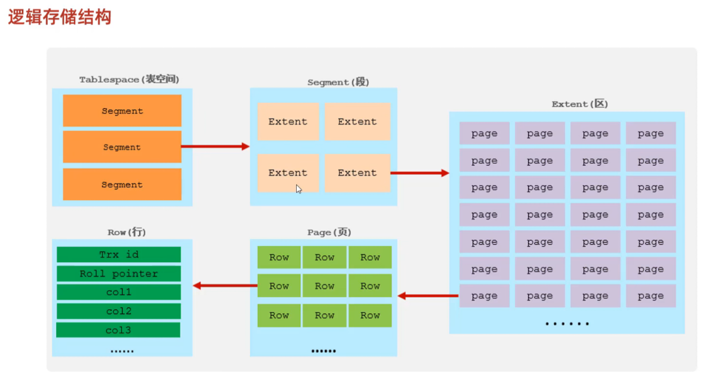

InnoDB 是 MySQL 默认的事务型存储引擎，以其高可靠性、事务支持和高并发性能成为企业级数据库的核心组件。以下从核心特性、技术实现、优化策略及适用场景等方面进行详细介绍：


---

### 一、核心特性
1. **事务支持与 ACID 特性**  
   InnoDB 完全支持事务的 **原子性（Atomicity）、一致性（Consistency）、隔离性（Isolation）、持久性（Durability）**，适用于需要严格数据一致性的场景（如金融交易系统）。通过 **Redo Log（重做日志）** 和 **Undo Log（撤销日志）** 实现崩溃恢复和事务回滚，确保数据持久化。

2. **行级锁与高并发**  
   采用 **行级锁定（Row-Level Locking）**，仅对涉及的数据行加锁，而非整个表，显著减少锁冲突。同时支持 **间隙锁（Gap Lock）** 防止幻读，以及 **MVCC（多版本并发控制）** 实现非阻塞读取，适合高并发读写场景（如电商秒杀系统）。

3. **外键约束与数据完整性**  
   InnoDB 是 MySQL 中首个支持 **外键（FOREIGN KEY）** 的存储引擎，自动维护关联表间的数据一致性，适用于复杂关系型数据模型（如订单管理系统）。

4. **存储结构优化**
    - **缓冲池（Buffer Pool）**：在内存中缓存热数据和索引，减少磁盘 I/O 操作，提升查询速度。
    - **表空间（Tablespace）**：支持共享表空间或独立表空间（通过 `innodb_file_per_table` 配置），数据文件大小仅受操作系统限制。

---

### 二、技术实现与优化
1. **存储架构**
    - **B+ 树索引**：主键采用聚簇索引（Clustered Index），数据与索引存储在同一结构中，减少随机 I/O；二级索引（Secondary Index）存储主键值，需回表查询。
    - **日志机制**：Redo Log 用于事务提交后的快速持久化，Undo Log 用于事务回滚和 MVCC 版本链。

2. **性能调优建议**
    - **合理设置缓冲池大小**：通常不超过物理内存的 80%，确保频繁访问的数据驻留内存。
    - **事务拆分**：避免长事务占用资源，将大事务拆分为短事务提交。
    - **批量插入优化**：使用多行插入语句（如 `INSERT INTO ... VALUES (1,2), (3,4)`）减少通信开销。

3. **参数配置**
    - `innodb_flush_log_at_trx_commit=1`（默认）保证事务持久性，但可调整为 `0` 或 `2` 以牺牲部分持久性换取更高吞吐量。
    - `innodb_log_file_size` 设置为缓冲池大小的 25%-50%，避免频繁日志刷新。

---

### 三、适用场景
1. **高并发事务系统**  
   如电商平台（处理每秒数十万订单）、社交网络（用户动态实时更新），利用行级锁和 MVCC 保障并发性能。

2. **数据一致性要求高的场景**  
   如银行系统（转账操作需原子性）、ERP 系统（库存管理需外键约束）。

3. **大规模数据存储**  
   支持 TB 级数据，结合分区表或分库分表策略，适用于数据仓库和日志分析系统。

---

### 四、与其他引擎对比
| 特性                | InnoDB              | MyISAM              | Memory              |
|---------------------|---------------------|---------------------|---------------------|
| **事务支持**        | 支持                | 不支持              | 不支持              |
| **锁机制**          | 行级锁              | 表级锁              | 无锁（内存操作）    |
| **外键**            | 支持                | 不支持              | 不支持              |
| **崩溃恢复**        | 自动恢复（Redo Log）| 需手动修复           | 数据丢失            |
| **适用场景**        | 高并发事务          | 静态数据/全文索引    | 临时数据/高速缓存   |

---

### 五、总结
InnoDB 凭借其事务安全、高并发处理能力和灵活的存储结构，成为 MySQL 的默认引擎。通过合理配置参数（如缓冲池大小、日志文件）和优化索引设计，可充分发挥其性能优势。对于需要强一致性、复杂事务支持或高吞吐量的业务（如金融、电商），InnoDB 是首选解决方案。


---


InnoDB的逻辑存储结构是一个分层设计的体系，从宏观到微观可分为表空间、段、区、页、行五个层级，具体如下：




---

### 1. **表空间（Tablespace）**
表空间是最高层逻辑结构，所有数据（包括索引、事务日志等）的存储容器。
- **类型**：
   - **系统表空间**：默认的共享表空间（如`ibdata1`），存储数据字典、撤销日志（undo log）、双写缓冲等信息。
   - **独立表空间**：启用`innodb_file_per_table`（默认开启）后，每个表独立存储为`.ibd`文件，包含该表的数据和索引。
   - **通用表空间**：用户自定义的表空间，可跨表共享。

---

### 2. **段（Segment）**
表空间由多个段组成，每个段对应不同功能的数据块。
- **主要类型**：
   - **数据段**：B+树的叶子节点，存储实际数据。
   - **索引段**：B+树的非叶子节点，存储索引信息。
   - **回滚段**：管理事务的undo日志，用于MVCC和事务回滚。

---

### 3. **区（Extent）**
段由连续的区构成，每个区固定大小为**1MB**，用于优化磁盘空间分配连续性。为了保证页的连续性，InnoDB存储引擎申请磁盘空间的时候，每一次会申请4到5个区。
- **组成**：
   - 默认页大小为16KB时，一个区包含64个连续页。
   - 若页大小调整（如4K、8K），区的页数量相应变化（如256页对应4K页）。

---

### 4. **页（Page）**
页是磁盘管理的最小单元，默认大小为**16KB**（可通过`innodb_page_size`调整），包含多种类型：
- **数据页**：存储实际行记录和B+树索引。
- **undo页**：存储事务的undo日志。
- **系统页**：管理元数据信息。
- **溢出页**：当行数据过大（如BLOB类型），仅存储指针，实际数据存于独立溢出页。

---

### 5. **行（Row）**
数据以行为单位存储在页中，每行包含：
- **显式列**：用户定义的字段数据。
- **隐藏列**：
   - **事务ID（trx_id）**：记录最后一次修改该行的事务标识。
   - **回滚指针（roll_pointer）**：指向undo日志，用于MVCC和历史版本查询。
- **行格式**：
   - **Compact**（默认）：压缩存储NULL值和固定长度类型，可变类型仅存实际长度。
   - **Dynamic**：大字段完全溢出存储，页内仅保留指针。
   - **Compressed**：支持数据压缩。

---

### 逻辑结构示意图
```
表空间 → 段 → 区 → 页 → 行  
```

---

### 补充说明
- **MVCC机制**：通过隐藏列`trx_id`和`roll_pointer`实现多版本并发控制，支持事务隔离。
- **行溢出处理**：超过页大小限制的数据通过溢出页存储，减少主页的碎片化。

如需进一步了解物理存储细节（如内存缓冲池、日志系统），可参考相关文档。