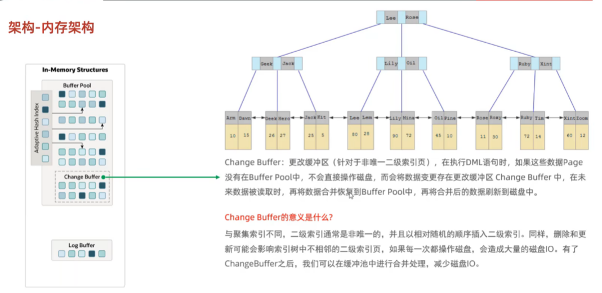

### InnoDB内存结构详解

InnoDB的内存结构是其高性能事务处理的核心支撑，主要包括**缓冲池（Buffer Pool）**、**日志缓冲区（Log Buffer）**、**更改缓冲区（Change Buffer）**、**自适应哈希索引（Adaptive Hash Index）**以及**事务系统相关内存区域**。以下是各部分的详细解析：

---

#### 一、缓冲池（Buffer Pool）
缓冲池是InnoDB最核心的内存组件，用于缓存磁盘数据页，减少磁盘I/O，默认占用系统内存的50%-80%。  

**核心组成**：
1. **数据页缓存**
    - 存储表和索引的数据页，所有读写操作优先在缓冲池中进行。
    - 数据页通过双向链表组织，采用改进的LRU算法管理（称为LRU-K算法），分为 **Young区（高频访问）** 和 **Old区（低频访问）**，默认比例5:3。
    - **Young区**：存放热点数据，新加载的页先插入到Old区头部（Midpoint），若被访问则提升到Young区。
    - **Old区**：存放预读或低频访问数据，避免全表扫描污染缓冲池。

2. **自适应哈希索引（AHI）**
    - 自动为频繁访问的索引页创建哈希索引，加速B+树查询，无需人工干预。

3. **多实例设计**
    - 通过`innodb_buffer_pool_instances`参数将缓冲池划分为多个实例，减少锁竞争，提升高并发性能（建议实例数不超过CPU核心数）。

4. **脏页管理**
    - 修改后的数据页称为“脏页”，通过**Flush链表**跟踪，由后台线程异步刷盘。
    - 通过`innodb_max_dirty_pages_pct`控制脏页比例（默认75%），防止突发刷盘导致性能抖动。

---

#### 二、日志缓冲区（Log Buffer）
日志缓冲区用于缓存事务的**重做日志（Redo Log）**和**撤销日志（Undo Log）**，默认16MB。  

**工作机制**：
- 事务提交时，日志按策略刷盘：
    - `innodb_flush_log_at_trx_commit=1`（默认）：每次提交刷盘，保证持久性。
    - `=0`或`=2`：延迟刷盘，牺牲部分持久性以提升性能。
- 大事务或高并发写入时，增大缓冲区可减少磁盘I/O频率。

---

#### 三、更改缓冲区（Change Buffer）
用于缓存对**非唯一二级索引**的修改（如INSERT/UPDATE/DELETE），避免频繁加载索引页到缓冲池。  

**工作流程**：
1. 当修改的索引页不在缓冲池时，操作暂存到更改缓冲区。
2. 后续该页被读取时，合并更改到缓冲池，再刷回磁盘。  
   **适用场景**：写多读少的索引（如日志表）。

---

#### 四、自适应哈希索引（Adaptive Hash Index）

- **动态创建**：根据查询模式自动为高频访问的索引页生成哈希索引，将B+树查询复杂度从O(log n)降至O(1)。
- **触发条件**：索引页连续访问次数达到阈值（由`innodb_adaptive_hash_index_parts`控制分区数）。

---

#### 五、其他内存组件
1. **锁结构（Lock Structure）**
    - 管理行锁、表锁及意向锁，存储事务的锁信息，支持并发控制。

2. **事务系统内存**
    - 维护事务状态、Undo Log缓存及全局事务表（Global Transaction Table），保障ACID特性。

3. **字典缓存（Dictionary Cache）**
    - 缓存表结构、列信息等元数据，减少元数据查询的磁盘I/O。

---

### 优化与监控建议
1. **缓冲池调优**
    - 设置`innodb_buffer_pool_size`为物理内存的70%-80%。
    - 多实例配置：当缓冲池>1GB时启用`innodb_buffer_pool_instances`。

2. **日志缓冲区优化**
    - 高并发场景下增大`innodb_log_buffer_size`（如256MB）。

3. **监控工具**
    - 使用`SHOW ENGINE INNODB STATUS`查看缓冲池命中率、脏页比例等。
    - 通过`INFORMATION_SCHEMA.INNODB_METRICS`获取详细指标。

---

### 总结
InnoDB通过分层内存设计（缓冲池、日志缓冲、更改缓冲等）实现高效数据缓存和事务处理，配合自适应哈希索引和锁机制，平衡了性能与一致性。合理配置内存参数及监控关键指标是优化数据库性能的核心手段。