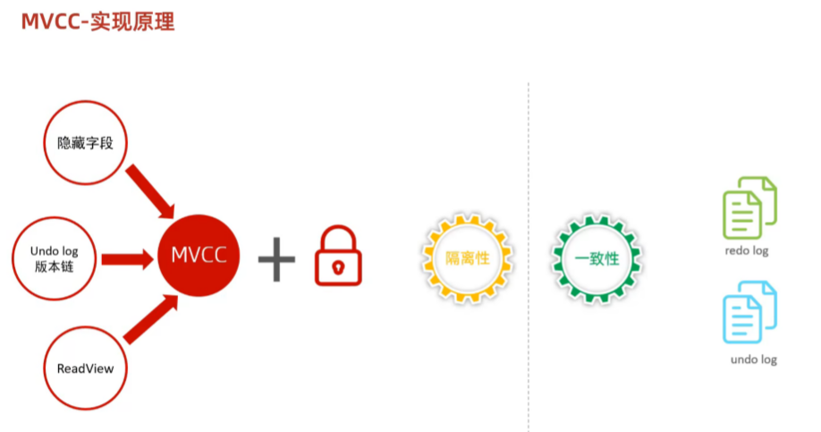
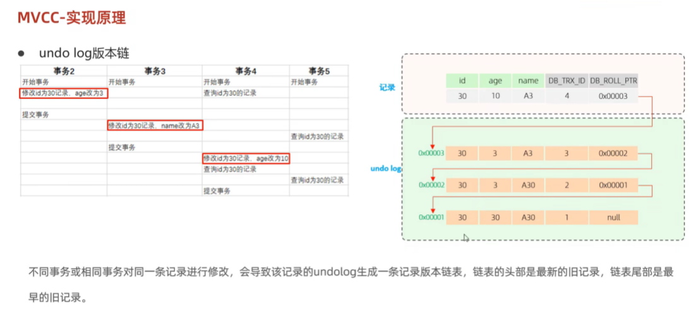
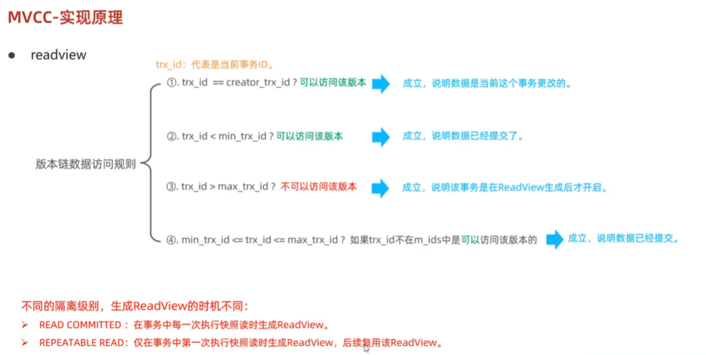
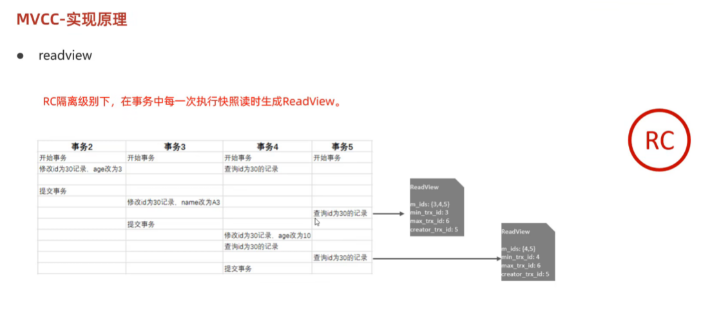
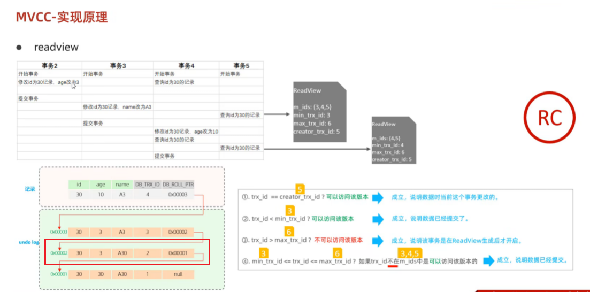
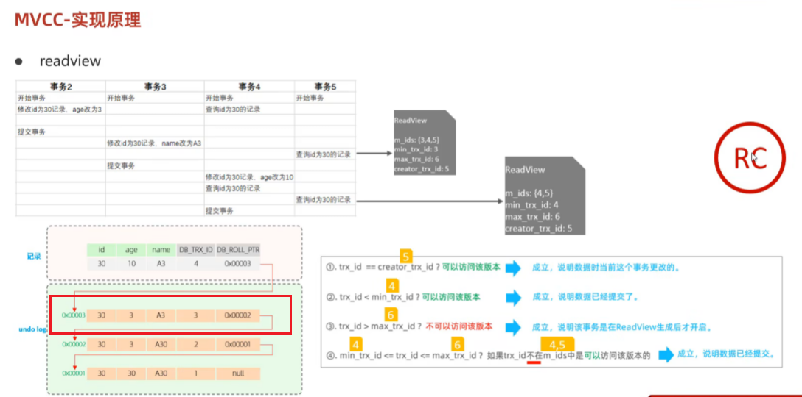
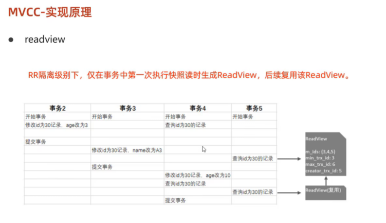

### 当前读（Current Read）详解

#### 一、定义与核心特点
**当前读**是MySQL中一种特殊的读取方式，其核心特点是**直接获取数据库当前最新的数据版本**，并在读取过程中通过加锁机制确保数据的**即时一致性**和**事务隔离性**。与快照读（Snapshot Read）不同，当前读会主动与其他事务的修改操作产生冲突控制，常用于需要严格数据一致性的场景。

**核心特点**：
1. **读取最新数据**：直接获取已提交事务的最新数据，而非历史版本。
2. **加锁机制**：通过共享锁（S锁）或排他锁（X锁）阻塞其他事务对数据的修改，保证并发安全。
3. **事务隔离性依赖**：在不同隔离级别下行为不同，例如在**SERIALIZABLE**级别下所有普通查询均强制转为当前读。

---

#### 二、触发当前读的操作
当前读主要通过以下SQL操作触发：
1. **显式加锁查询**：
    - `SELECT ... FOR UPDATE`：加排他锁（X锁），禁止其他事务读写。
    - `SELECT ... LOCK IN SHARE MODE`：加共享锁（S锁），允许其他事务读但禁止写。
2. **隐式加锁操作**：
    - **DML操作**：`UPDATE`、`DELETE`、`INSERT`等数据修改语句在执行时会自动触发当前读，确保修改基于最新数据。
    - **示例**：更新某行数据前需先读取其最新值，此时执行的是当前读。

---

#### 三、实现机制与锁控制
1. **锁类型与范围**：
    - **行锁（Record Lock）**：锁定单行数据，适用于明确主键或唯一索引的精确查询（如`WHERE id=1`）。
    - **间隙锁（Gap Lock）**：锁定索引范围内的间隙，防止其他事务插入新数据（如`WHERE id>10`），避免幻读。
    - **临键锁（Next-Key Lock）**：行锁与间隙锁的组合，默认在**可重复读（RR）**隔离级别下使用。

2. **锁的触发条件**：
    - **主键/唯一索引**：若`WHERE`条件精确命中，仅加行锁。
    - **非唯一索引或无索引**：可能导致全表锁或范围间隙锁，需谨慎设计查询条件。

**示例**：
```sql
-- 场景1：主键精确命中，仅锁行
SELECT * FROM user WHERE id=1 FOR UPDATE;

-- 场景2：无索引字段查询，触发全表间隙锁
SELECT * FROM user WHERE name='Alice' FOR UPDATE;
```

---

#### 四、当前读与事务隔离级别的关系
不同隔离级别对当前读的行为有显著影响：
1. **READ COMMITTED（读已提交）**：
    - 当前读仅读取已提交的最新数据，但可能因其他事务提交导致不可重复读。
2. **REPEATABLE READ（可重复读）**：
    - 当前读通过临键锁避免幻读，保证同一事务内多次读取的数据一致性。
3. **SERIALIZABLE（串行化）**：
    - **所有普通查询强制转为当前读**，完全依赖锁机制实现串行化执行。

---

#### 五、实际应用场景
1. **库存扣减**：
    - 使用`SELECT ... FOR UPDATE`锁定库存行，防止超卖。
   ```sql
   BEGIN;
   SELECT stock FROM products WHERE id=100 FOR UPDATE;
   UPDATE products SET stock=stock-1 WHERE id=100;
   COMMIT;
   ```
2. **账户余额操作**：
    - 更新前锁定账户行，确保余额计算基于最新值。
3. **数据强一致性校验**：
    - 需要实时获取最新状态的业务逻辑（如订单状态变更）。

---

#### 六、注意事项与优化
1. **锁竞争风险**：
    - 不当的锁范围（如全表锁）会导致性能瓶颈，需优化索引设计。
2. **死锁预防**：
    - 事务按固定顺序访问资源，减少锁交叉等待。
3. **隔离级别选择**：
    - 根据业务需求选择最低必要隔离级别（如非必要避免使用串行化）。

---

### 总结
当前读通过**加锁机制**和**读取最新数据**的特性，为高并发场景下的数据强一致性提供了保障。其核心价值体现在库存管理、金融交易等对数据实时性要求严格的场景中。理解其实现原理（如临键锁、间隙锁）及与隔离级别的关联，有助于优化数据库设计并规避潜在性能问题。

---

### 快照读（Snapshot Read）详解

#### 一、定义与核心特点
**快照读**是数据库（如MySQL的InnoDB引擎）通过**多版本并发控制（MVCC）**实现的一种非锁定读机制。其核心特点是**读取事务开始时或某个时间点的数据快照版本**，而非实时最新数据。这种机制通过避免加锁实现读写操作的并行化，从而提升并发性能。

**核心特点**：
1. **无锁读取**：不会对数据行加锁，减少锁竞争，提升并发吞吐量。
2. **历史版本访问**：基于Undo Log的版本链回溯数据历史状态，确保一致性视图。
3. **事务隔离性支持**：
    - **可重复读（RR）**：事务内所有快照读基于首次读取时的快照。
    - **读已提交（RC）**：每次快照读生成新快照，读取最新已提交数据。

---

#### 二、实现机制
1. **Undo Log版本链**：
    - 每次数据修改时，InnoDB将旧版本数据存入Undo Log，形成按时间排序的版本链。链首为最新数据，链尾为初始数据。
    - 例如：更新一行数据时，旧值会被复制到Undo Log，并通过回滚指针（`DB_ROLL_PTR`）串联成链。

2. **Read View（读视图）**：
    - **生成时机**：
        - **RR隔离级别**：事务首次执行快照读时生成，后续复用。
        - **RC隔离级别**：每次快照读均生成新Read View。
    - **关键属性**：
        - `m_ids`：活跃事务ID列表。
        - `min_trx_id`：最小活跃事务ID。
        - `max_trx_id`：下一个待分配事务ID。
    - **可见性规则**：通过对比数据行的`DB_TRX_ID`与Read View属性，判断当前事务能否“看到”该版本数据。

---

#### 三、隔离级别对快照读的影响
1. **可重复读（RR）**：
    - 事务首次快照读生成Read View后，后续所有读操作基于同一视图，保证同一事务内多次读取结果一致，避免不可重复读。
    - **示例**：事务A读取数据后，事务B修改并提交，事务A再次读取时仍看到旧版本数据。

2. **读已提交（RC）**：
    - 每次快照读生成新Read View，读取最新已提交数据版本，可能因其他事务提交导致不可重复读。

3. **Serializable**：
   - 快照读会退化为当前读。

---

#### 四、应用场景
1. **高并发查询**：
    - 如电商平台的商品浏览、社交媒体的信息流加载，快照读允许大量读请求并行执行，避免阻塞写操作。

2. **长事务分析**：
    - 金融对账、历史数据分析等场景中，快照读基于固定快照保证数据一致性，避免中间修改干扰结果。

3. **非实时性操作**：
    - 数据报表生成、缓存预热等对实时性要求较低的场景。

---

#### 五、优缺点分析
| **优点**                          | **缺点**                          |
|-----------------------------------|-----------------------------------|
| 读写无锁竞争，提升并发性能 | 存储历史版本需额外空间（Undo Log膨胀） |
| 支持事务隔离性（RR/RR级别） | 旧版本数据需Purge线程异步清理       |
| 简化死锁管理（无锁机制）       | 无法读取未提交事务的数据（可能需强制当前读） |

---

#### 六、与当前读的对比
| **维度**       | **快照读**                     | **当前读**                     |
|----------------|--------------------------------|--------------------------------|
| **数据版本**   | 历史版本（Read View决定）      | 最新已提交版本                 |
| **加锁机制**   | 无锁                          | 加共享锁（S）或排他锁（X） |
| **适用操作**   | 普通`SELECT`（无锁）          | `SELECT FOR UPDATE`、DML语句 |
| **隔离级别**   | 支持RR、RC级别                | 所有隔离级别                   |

---

### 总结
快照读通过MVCC机制实现了**非锁定读**与**一致性视图**的平衡，是数据库高并发场景的核心技术。其底层依赖Undo Log版本链和Read View的可见性判断，不同隔离级别下行为差异显著（如RR的固定快照与RC的动态快照）。尽管存在存储开销和版本清理问题，但其在读写分离、长事务处理等场景中的优势不可替代。理解快照读的实现原理与适用边界，对数据库性能优化和事务设计至关重要。


---

### MVCC（多版本并发控制）详解



#### 一、核心概念与作用
**MVCC（Multi-Version Concurrency Control）** 是一种数据库并发控制技术，通过维护数据的多个版本实现读写操作的并行化，从而提升数据库的并发性能。其核心目标是解决传统锁机制在高并发场景下的性能瓶颈，具体作用包括：
1. **读写不冲突**：读操作基于历史快照，写操作生成新版本，两者互不阻塞。
2. **事务隔离性保障**：
    - 避免脏读：读取已提交的版本数据。
    - 解决不可重复读：同一事务内多次快照读基于同一 Read View。
    - 部分幻读：快照读通过版本链避免，但当前读仍需锁机制辅助。
3. **性能优化**：通过非锁定读（快照读）减少锁争用，提升吞吐量。

#### 二、核心实现机制
MVCC 的实现依赖三个核心组件：
1. **隐藏字段**：
    - **DB_TRX_ID**：记录最后一次修改该行的事务 ID。
    - **DB_ROLL_PTR**：回滚指针，指向该行历史版本的 Undo Log 记录，形成版本链。
    - **DB_ROW_ID**（可选）：隐式主键，用于无主键表的聚簇索引。

2. **Undo Log 版本链**：
    - 每次更新操作将旧数据拷贝到 Undo Log，形成版本链（链首为最新版本）。
    - 作用包括事务回滚、支持快照读和版本追溯。

3. **Read View（读视图）**：
    - **生成时机**：
        - **RC（读已提交）**：每次快照读生成新 Read View。
        - **RR（可重复读）**：事务首次快照读时生成，后续复用。
    - **关键属性**：
        - **m_ids**：生成时的活跃事务 ID 列表。
        - **min_trx_id**：活跃事务最小 ID。
        - **max_trx_id**：下一个待分配的事务 ID。
        - **creator_trx_id**：创建该视图的事务 ID。

    - **可见性规则**：
        1. **DB_TRX_ID == creator_trx_id**：可见（当前事务自身修改）。
        2. **DB_TRX_ID < min_trx_id**：可见（事务已提交）。
        3. **DB_TRX_ID ≥ max_trx_id**：不可见（事务未提交或晚于当前事务）。
        4. **min_trx_id ≤ DB_TRX_ID < max_trx_id**：
            - 若在 m_ids 中：不可见（事务未提交）。
            - 若不在 m_ids 中：可见（事务已提交）。

#### 三、隔离级别的实现差异
1. **RC（读已提交）**：
    - 每次快照读生成新 Read View，保证读取已提交的最新版本。
    - 解决脏读，但无法避免不可重复读。

2. **RR（可重复读）**：
    - 事务首次快照读时生成 Read View，后续复用。
    - 通过固定数据快照解决不可重复读，但需结合锁机制处理幻读。


#### 四、典型应用场景
1. **高并发读场景**（如电商秒杀）：
    - 读操作访问历史版本，写操作生成新版本，避免阻塞。
    - 示例：10 万用户同时查询库存时，MVCC 允许并行读取快照，仅写操作更新实际数据。

2. **长事务处理**（如银行对账）：
    - 固定 Read View 保持数据一致性，避免中途其他事务修改导致数据波动。

3. **OLAP 系统**：
    - 复杂查询基于历史快照执行，不阻塞实时写入操作。

#### 五、与传统锁机制的对比
| **维度**       | **MVCC**                          | **传统锁机制**                |
|----------------|-----------------------------------|-------------------------------|
| **读写冲突**   | 读写不阻塞                        | 读写互斥                      |
| **性能**       | 高并发读场景性能更优              | 高并发写场景更稳定            |
| **死锁风险**   | 无死锁（通过版本隔离）            | 需复杂死锁检测机制            |
| **实现复杂度** | 高（需维护版本链和 Read View）    | 低（直接加锁）                |
| **适用场景**   | 读多写少（如电商、社交平台）      | 写密集（如金融交易系统）      |

#### 六、优缺点分析
**优势**：
- **高并发性**：非锁定读减少锁争用，支持数千并发连接。
- **数据一致性**：通过快照隔离保证事务可见性。
- **避免死锁**：无需锁竞争，天然规避死锁问题。

**挑战**：
- **存储开销**：多版本数据占用额外存储空间。
- **版本管理复杂度**：需定期清理旧版本（如 MySQL 的 Purge 线程）。
- **部分幻读问题**：RR 级别下快照读无法完全避免幻读，需结合间隙锁。

#### 七、技术实现对比（MySQL vs PostgreSQL）
| **维度**       | **MySQL InnoDB**                | **PostgreSQL**                |
|----------------|---------------------------------|-------------------------------|
| **版本存储**   | 通过 Undo Log 维护版本链 | 多版本堆存储（Heap） |
| **清理机制**   | Purge 线程异步清理旧版本 | VACUUM 进程手动/自动清理 |
| **可见性判断** | 依赖 Read View          | 使用事务快照（Snapshot） |

---

### 总结
MVCC 通过多版本数据管理，在保障事务隔离性的同时显著提升了数据库并发性能，成为现代数据库（如 MySQL、PostgreSQL）的核心机制。其核心设计包括版本链、Read View 和可见性规则，通过非锁定读与写操作的并行化，平衡了数据一致性与系统吞吐量。理解 MVCC 的实现细节，对优化高并发场景下的数据库性能具有重要意义。


---

### MVCC的实现原理深度解析

MVCC（多版本并发控制）是现代数据库（如MySQL、PostgreSQL）实现高并发事务的核心机制，其核心原理是通过维护数据的多个历史版本，使读写操作可以并行执行而不产生锁冲突。以下从核心组件、运行机制、隔离级别实现三个维度进行详细分析：

---

#### 一、核心实现组件
1. **隐藏字段与版本追踪**  
   InnoDB为每行数据添加三个隐藏字段：
   - **DB_TRX_ID**（6字节）：记录最后一次修改该行的事务ID，作为版本标识
   - **DB_ROLL_PTR**（7字节）：回滚指针，指向Undo Log中的旧版本数据，形成版本链
   - **DB_ROW_ID**（6字节）：隐式主键，当表无显式主键时自动生成聚簇索引

   *示例*：当事务ID=100更新某行数据时，DB_TRX_ID被置为100，旧值存入Undo Log并通过DB_ROLL_PTR链接成链。

2. **Undo Log版本链**  

   

   每次数据修改（INSERT/UPDATE/DELETE）时：
   - 旧数据被拷贝到Undo Log，形成按时间排序的版本链（链首为最新版本）
   - **Insert Undo Log**：仅用于事务回滚，提交后立即回收
   - **Update Undo Log**：保留历史版本供快照读使用，由Purge线程异步清理

   *结构示例*：
   ```
   当前版本（TRX_ID=200）← 旧版本（TRX_ID=150）← 初始版本（TRX_ID=0）
   ```

3. **Read View（读视图）**  
   事务首次快照读时生成，包含四个关键属性：
   - **m_ids**：当前活跃事务ID列表（未提交的事务）
   - **min_trx_id**：活跃事务中的最小ID
   - **max_trx_id**：下一个待分配事务ID（当前最大ID+1）
   - **creator_trx_id**：创建该视图的事务ID

---

#### 二、数据可见性规则
通过Read View与版本链的协同，实现数据的多版本可见性判断：
1. **可见性判断流程**
   - **步骤1**：从版本链头部（最新版本）开始遍历
   - **步骤2**：对比数据版本的TRX_ID与Read View参数：
      - **TRX_ID < min_trx_id** → 可见（版本在视图生成前已提交）
      - **TRX_ID ≥ max_trx_id** → 不可见（版本在视图生成后创建）
      - **min_trx_id ≤ TRX_ID < max_trx_id**：
         - 若TRX_ID在m_ids中 → 不可见（事务未提交）
         - 若TRX_ID不在m_ids中 → 可见（事务已提交）
   - **步骤3**：沿版本链回溯，直到找到符合条件的最旧可见版本

   *示例*：当事务A（TRX_ID=100）的Read View中min_trx_id=90，max_trx_id=110，若某版本TRX_ID=95且不在m_ids中，则该版本可见。

2. **隔离级别实现差异**
   - **读已提交（RC）**：每次查询生成新Read View，读取最新已提交版本（可能产生不可重复读）
   - **可重复读（RR）**：事务首次查询生成Read View后固定使用，保证多次读取一致性（解决不可重复读）

---

#### 三、版本管理与清理机制
1. **Purge线程作用**
   - 定期扫描Undo Log，清理不再被任何事务引用的旧版本
   - 回收Undo页空间，防止版本链无限膨胀

2. **长事务风险**
   - 未提交的长事务会导致Purge无法清理其关联的历史版本，引发存储空间暴增
   - 监控建议：通过`information_schema.INNODB_TRX`表查询事务持续时间

---

#### 四、与其他机制的协同
1. **与锁机制配合**
   - 快照读基于MVCC实现无锁，而当前读（如SELECT FOR UPDATE）仍需加行锁/间隙锁防止幻读
   - 例：RR级别下通过临键锁（Next-Key Lock）阻止其他事务插入数据，弥补MVCC的幻读缺陷

2. **跨数据库实现对比**  

   | **维度**       | MySQL InnoDB                | PostgreSQL               |
   |----------------|-----------------------------|--------------------------|
   | 版本存储       | Undo Log维护版本链          | Heap多版本存储           |
   | 清理机制       | Purge线程异步清理           | VACUUM进程手动/自动清理  |
   | 可见性判断     | Read View                   | 事务快照（Snapshot）     |

---

### 总结
MVCC通过**版本链管理**和**动态可见性判断**，在保障事务隔离性的同时大幅提升并发性能。其核心设计思想是将数据版本化，使读写操作在时间维度上解耦。理解隐藏字段的作用、Read View生成规则及版本清理机制，对优化数据库性能（如控制长事务、合理设计索引）具有重要实践意义。


---

### ReadView 实现原理与核心机制详解

ReadView 是 MySQL InnoDB 存储引擎中实现 **多版本并发控制（MVCC）** 的核心组件，用于在事务快照读时确定数据版本的可见性。它通过维护事务活跃状态和版本链管理，实现不同隔离级别下的数据一致性。以下是其核心实现原理与工作机制：

---

#### 一、ReadView 的核心组成
ReadView 是一个动态生成的视图结构，包含以下关键属性：
1. **`m_ids`（活跃事务列表）**  
   生成 ReadView 时，系统中所有 **未提交事务的 ID 集合**。例如，若事务 A（ID=100）、事务 B（ID=200）未提交，则 `m_ids = [100, 200]`。

2. **`up_limit_id`（低水位）**  
   活跃事务列表中的 **最小事务 ID**。例如，若 `m_ids = [100, 200]`，则 `up_limit_id = 100`。

3. **`low_limit_id`（高水位）**  
   生成 ReadView 时系统 **尚未分配的下一个事务 ID**（即当前最大事务 ID +1）。例如，若当前最大事务 ID 是 300，则 `low_limit_id = 301`。

4. **`creator_trx_id`**  
   创建该 ReadView 的事务的 ID。若事务未执行写操作（如只读事务），则此值为 `0`。

---

#### 二、可见性判断规则
ReadView 通过 **事务 ID 对比** 和 **版本链遍历** 决定当前事务可见的数据版本：
1. **比较数据版本的 `DB_TRX_ID`**  
   每行数据的隐藏字段 `DB_TRX_ID` 记录了最后一次修改它的事务 ID。根据以下规则判断可见性：
   - **规则 1**：若 `DB_TRX_ID < up_limit_id`  
     说明该版本由 **已提交事务** 修改，可见。
   - **规则 2**：若 `DB_TRX_ID ≥ low_limit_id`  
     说明该版本在 ReadView 生成后创建，不可见。
   - **规则 3**：若 `up_limit_id ≤ DB_TRX_ID < low_limit_id`
      - 若 `DB_TRX_ID` 不在 `m_ids` 中：事务已提交，可见。
      - 若 `DB_TRX_ID` 在 `m_ids` 中：事务未提交，不可见。

2. **版本链回溯**  
   若当前版本不可见，则通过 `DB_ROLL_PTR` 指针在 Undo Log 中 **沿版本链向前遍历**，重复上述规则，直到找到可见的版本或到达链尾。

---

#### 三、隔离级别对 ReadView 的影响
不同隔离级别下 ReadView 的生成策略不同，直接影响事务的可见性：
1. **读已提交（RC）**
   - **每次快照读生成新 ReadView**，因此能读取其他事务已提交的最新数据。
   - **示例**：事务 C 在 T4、T6、T8 时刻三次读取同一行数据，可能分别看到“小明”“小红”“小白”（其他事务提交后新 ReadView 生效）。

2. **可重复读（RR）**
   - **事务首次快照读时生成 ReadView**，后续所有读操作复用该视图。
   - **示例**：事务 C 在 T4 时刻生成 ReadView 后，后续读取始终基于 T4 时的活跃事务状态，因此多次读取结果一致（如始终看到“小明”）。

---

#### 四、实际应用场景与示例
1. **长事务的一致性保证**  
   例如金融对账场景，事务 A 在生成 ReadView 后，即使其他事务 B、C 修改并提交数据，事务 A 仍基于初始快照读取历史版本，确保对账逻辑一致。

2. **高并发查询优化**  
   电商场景中，大量用户查询商品库存时通过快照读访问历史版本，避免与库存扣减的写操作冲突，提升并发性能。

---

#### 五、注意事项与优化
1. **长事务风险**
   - 未提交的长事务会导致其关联的旧版本无法被 Purge 线程清理，可能引发存储膨胀。
   - **建议**：监控 `information_schema.INNODB_TRX`，控制事务执行时间。

2. **索引设计影响**
   - 无索引的查询可能导致全表扫描加锁（如间隙锁），破坏 MVCC 的无锁读优势。
   - **建议**：为高频查询字段添加索引，缩小锁范围。

---

### 总结
ReadView 通过动态维护事务活跃状态和版本链可见性规则，成为 MVCC 实现高并发与数据一致性的核心机制。理解其生成时机（如 RC 的动态视图与 RR 的固定视图）、可见性判断逻辑（高低水位对比）及版本链回溯机制，对优化数据库事务设计（如隔离级别选择、长事务控制）具有重要意义。在实际应用中，需结合业务场景权衡一致性需求与性能开销，避免因 ReadView 使用不当导致的数据可见性问题或存储膨胀。

---

### 版本链数据访问规则详解

MVCC（多版本并发控制）中的 **版本链** 是数据库实现多版本历史记录的核心数据结构，由隐藏字段和Undo Log维护。**数据访问规则** 决定了事务如何从版本链中选择可见的数据版本，其核心逻辑基于 **ReadView** 的可见性判断机制，具体规则如下：

---

#### 一、版本链的构成
版本链由数据行的多个历史版本通过 **DB_ROLL_PTR（回滚指针）** 串联形成，每个版本包含以下信息：
- **DB_TRX_ID**：最后一次修改该行的事务ID。
- **DB_ROLL_PTR**：指向Undo Log中前一个版本的指针。
- 数据行的历史值（如字段值、删除标记等）。

**示例**：  
假设事务T1（ID=100）插入数据，事务T2（ID=200）修改该数据，事务T3（ID=300）再次修改，则版本链结构如下：
```
最新版本（T3）← 旧版本（T2）← 初始版本（T1）
```

---

#### 二、数据访问规则的核心步骤
当事务执行快照读时，基于其 **ReadView** 对版本链进行遍历，规则如下：










1. **判断当前事务是否可见自身修改**
   - **规则**：若数据版本的 `DB_TRX_ID == creator_trx_id`（当前事务ID），则直接可见。
   - **场景**：事务内修改的数据，即使未提交，也能被自身读取（保证事务内一致性）。

2. **检查版本是否在低水位以下**
   - **规则**：若 `DB_TRX_ID < min_trx_id`（ReadView中的最小活跃事务ID），说明该版本由 **已提交事务** 修改，可见。
   - **示例**：若活跃事务列表为 `[200, 300]`，`min_trx_id=200`，则版本 `DB_TRX_ID=150` 可见。

3. **排除高水位以上的版本**
   - **规则**：若 `DB_TRX_ID ≥ max_trx_id`（预分配的最大事务ID），说明该版本在ReadView生成后创建，不可见。
   - **示例**：若 `max_trx_id=400`，则事务ID≥400的版本均不可见。

4. **判断活跃事务区间内的可见性**
   - **规则**：若 `min_trx_id ≤ DB_TRX_ID < max_trx_id`，需进一步检查：
      - **活跃事务列表（m_ids）中**：若 `DB_TRX_ID` 存在于活跃事务列表，说明该事务未提交，不可见。
      - **不在活跃事务列表**：说明事务已提交，可见。
   - **示例**：若活跃事务为 `[200, 250]`，某版本的 `DB_TRX_ID=230` 在列表中不可见，而 `DB_TRX_ID=240`（不在列表）则可见。

5. **版本链回溯**
   - **规则**：若当前版本不可见，沿 `DB_ROLL_PTR` 回溯至上一个版本，重复上述规则，直至找到可见版本或链尾。
   - **终止条件**：链尾版本仍不可见时，返回空值（如删除标记为真的数据）。

---

#### 三、隔离级别对访问规则的影响
1. **读已提交（RC）**
   - **规则**：每次快照读生成新ReadView，读取最新已提交版本。
   - **效果**：可能读到其他事务已提交的新数据，导致 **不可重复读**。

2. **可重复读（RR）**

   
   
   - **规则**：事务首次快照读生成ReadView，后续复用该视图。
   - **效果**：保证同一事务内多次读取结果一致，但需配合 **间隙锁** 解决幻读。

---

#### 四、示例场景分析
**场景**：
- 事务A（ID=100）生成ReadView，活跃事务列表为 `[200, 300]`，`min_trx_id=200`，`max_trx_id=400`。
- 版本链：`V3（DB_TRX_ID=250）← V2（DB_TRX_ID=150）← V1（DB_TRX_ID=50）`。

**可见性判断**：
1. **V3**：`DB_TRX_ID=250` 在 `[200, 300]` 区间且属于活跃事务，不可见。
2. **V2**：`DB_TRX_ID=150 < min_trx_id=200`，可见。
3. **结果**：事务A读取V2版本的数据。

---

#### 五、版本链管理的优化与挑战
1. **存储开销**
   - 版本链依赖Undo Log存储历史版本，可能导致存储膨胀。
   - **优化**：通过Purge线程清理不再被引用的旧版本。

2. **长事务风险**
   - 长事务会导致其关联的旧版本无法清理，需监控事务执行时间。

3. **锁机制协同**
   - 当前读（如`SELECT FOR UPDATE`）需加锁，与版本链的快照读互补。

---

### 总结
版本链的数据访问规则是MVCC实现高并发的核心逻辑，通过ReadView的可见性判断和版本链回溯机制，平衡了读写操作的隔离性与性能。理解其规则对设计高并发数据库事务（如电商库存管理、金融交易）至关重要，需结合隔离级别和锁机制综合优化。

---


### InnoDB 核心机制总结

#### **一、逻辑存储结构**
InnoDB 的逻辑存储采用层级化设计，从宏观到微观分为五层：
1. **表空间（Tablespace）**
   - 存储逻辑数据的最高层级，每个表对应独立的 `.ibd` 文件（默认开启 `innodb_file_per_table`）。
   - 包含数据、索引、插入缓冲等，而系统表空间（`ibdata1`）存储数据字典、双写缓冲等全局数据。

2. **段（Segment）**
   - **数据段**（B+树叶子节点）、**索引段**（B+树非叶子节点）、**回滚段**（Undo Log 管理）。
   - 段管理多个区（Extent），优化磁盘空间的分配与回收。

3. **区（Extent）**
   - 固定大小为 **1MB**，由 **64个连续页（16KB/页）** 构成，确保数据物理连续性，减少随机I/O。

4. **页（Page）**
   - 磁盘管理的最小单元（默认16KB），分为数据页、索引页、Undo页等类型。
   - 每次从磁盘申请 **4-5个区**，保证大块连续存储。

5. **行（Row）**
   - 数据按行存储，含两个隐藏字段：
      - **trx_id**：最后一次修改该行的事务ID。
      - **roll_pointer**：指向Undo Log版本链的指针，支持MVCC。

---

#### **二、架构设计**
InnoDB 架构分为 **内存结构** 与 **磁盘结构**，协同实现高性能与数据安全：
1. **内存结构**
   - **Buffer Pool**：缓存热数据页，分三类状态：
      - **Free Page**（空闲）、**Clean Page**（未修改）、**Dirty Page**（已修改待刷盘）。
      - 采用LRU变体算法管理，优化缓存命中率。
   - **Change Buffer**：缓存非唯一索引的修改（如插入、删除），减少随机磁盘I/O。
   - **Log Buffer**：暂存Redo/Undo日志，通过 `innodb_flush_log_at_trx_commit` 控制刷盘策略。

2. **磁盘结构**
   - **系统表空间**：存储元数据、双写缓冲（Doublewrite Buffer），保障数据页写入的原子性。
   - **独立表空间**（.ibd文件）：每表独立存储数据与索引。
   - **Redo Log**：顺序写入物理日志（`ib_logfile0/1`），实现崩溃恢复与持久性。
   - **Undo Log**：逻辑日志记录数据修改前的状态，支持事务回滚与MVCC。

3. **后台线程**
   - **Master Thread**：调度脏页刷新、Undo回收等核心任务。
   - **IO Thread**：异步处理读写请求（默认4读4写线程）。
   - **Purge Thread**：清理已提交事务的Undo Log。

---

#### **三、事务原理**
InnoDB 通过 **Redo Log** 与 **Undo Log** 保障事务的ACID特性：
1. **原子性（Atomicity）**
   - **Undo Log** 记录反向操作（如INSERT对应DELETE），事务回滚时通过版本链恢复原始数据。

2. **持久性（Durability）**
   - **Redo Log** 顺序记录物理修改，事务提交时优先刷盘（WAL机制），崩溃后通过日志重放恢复数据。

3. **隔离性（Isolation）**
   - **锁机制**：行锁、间隙锁、临键锁控制并发访问。
   - **MVCC**：通过版本链与ReadView实现非锁定一致性读。

4. **一致性（Consistency）**
   - 由原子性、隔离性、持久性共同保障，结合应用层约束（如外键）确保数据逻辑一致。

---

#### **四、MVCC实现**
MVCC（多版本并发控制）通过 **版本链** 与 **ReadView** 实现高并发下的读写隔离：
1. **版本链构建**
   - 每行数据包含 `trx_id`（修改事务ID）和 `roll_pointer`（指向Undo Log旧版本）。
   - 更新操作生成新版本，形成链式历史记录。

2. **ReadView规则**
   - 事务启动时生成快照，记录活跃事务ID列表（`trx_ids`）、最小活跃事务ID（`up_limit_id`）、最大事务ID（`low_limit_id`）。
   - **可见性判断**：
      - 若 `trx_id < up_limit_id`：版本已提交，可见。
      - 若 `trx_id ≥ low_limit_id`：版本属于未来事务，不可见。
      - 若 `trx_id` 在活跃列表中：事务未提交，不可见。

3. **隔离级别差异**
   - **读已提交（RC）**：每次查询生成新ReadView，可能读到其他事务已提交的修改。
   - **可重复读（RR）**：事务内复用首次ReadView，保证多次读取结果一致。

---

### 总结对比
| **模块**          | **核心组件/机制**               | **关键作用**                          |  
|--------------------|---------------------------------|---------------------------------------|  
| **逻辑存储**       | 表空间、区、页、行              | 数据物理组织与高效访问                |  
| **内存架构**       | Buffer Pool、Change Buffer      | 缓存加速与减少磁盘I/O                 |  
| **事务机制**       | Redo Log、Undo Log、锁          | 保障ACID特性与高并发控制              |  
| **MVCC**           | 版本链、ReadView                | 非锁定读与隔离级别实现                |  

通过上述机制，InnoDB在保证事务安全的同时，实现了高性能并发处理，适用于OLTP等高负载场景。