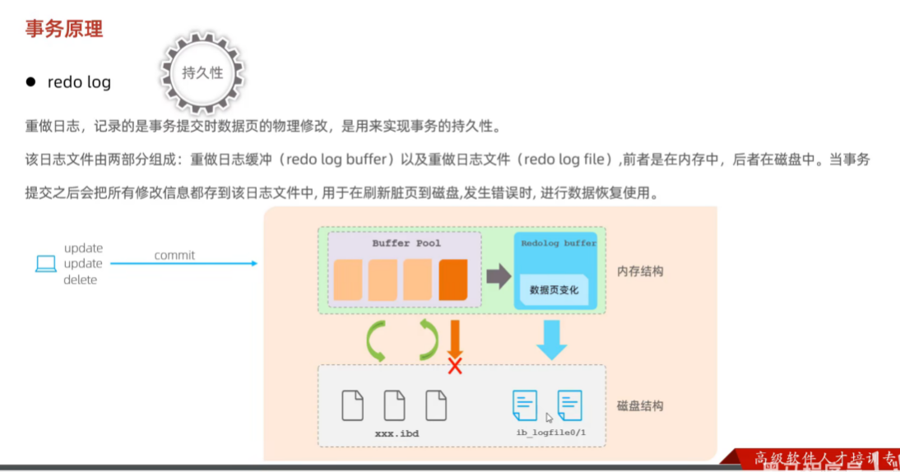

### Redo Log 详解

#### 一、基础概念与作用
**Redo Log（重做日志）** 是 MySQL InnoDB 存储引擎的核心组件，主要用于 **保障事务的持久性** 和 **数据库崩溃恢复**。其核心作用包括：
1. **持久性保障**：事务提交后，即使系统崩溃，通过 Redo Log 可恢复未刷盘的脏页数据。
2. **性能优化**：采用 **顺序 I/O** 记录数据页修改，替代直接刷盘的 **随机 I/O**，提升事务处理效率。
3. **崩溃恢复**：重启时根据 Redo Log 重放操作，将数据恢复到崩溃前的状态。

#### 二、结构与工作流程
1. **核心组成**：
    - **Redo Log Buffer**：内存缓冲区，默认 16MB（`innodb_log_buffer_size`），暂存事务修改操作。
    - **Redo Log File**：磁盘文件（如 `ib_logfile0`、`ib_logfile1`），循环写入物理日志，记录数据页的具体修改。
    - **Log Block**：存储单位，每个 512 字节，包含块头、日志内容、块尾，确保写入原子性。

2. **写入流程**：
    - **事务提交时**：日志按策略刷盘，参数 `innodb_flush_log_at_trx_commit` 控制：
        - **1（默认）**：每次提交刷盘，保证强持久性。
        - **0/2**：延迟刷盘（每秒或依赖系统缓存），牺牲部分持久性以提升性能。
    - **异步刷盘**：后台线程（如 Master Thread）定期将缓冲池脏页刷到磁盘。

#### 三、工作原理与关键技术
1. **WAL 技术（Write-Ahead Logging）**：
    - **先写日志，再写磁盘**：修改数据前先记录 Redo Log，确保即使崩溃也能恢复。
    - **物理日志特性**：记录数据页的 **页号、偏移量、修改内容**，而非逻辑 SQL 语句。

2. **崩溃恢复机制**：
    - **LSN（日志序列号）**：单调递增的版本标记，用于定位恢复起点。
    - **Checkpoint（检查点）**：标记已刷盘的日志位置，缩短恢复时间。

3. **多版本支持**：
    - 每个 Redo 日志包含 **事务 ID** 和 **版本链指针**，支持 MVCC（多版本并发控制）。

#### 四、应用场景与优化
1. **典型场景**：
    - **高并发事务处理**：如金融交易系统，保障提交数据的完整性。
    - **主从复制**：配合 Binlog 实现数据同步（需两阶段提交）。
    - **大规模数据修改**：批量操作时减少磁盘 I/O 压力。

2. **优化建议**：
    - **调整日志文件大小**：通过 `innodb_log_file_size` 扩大日志容量，减少频繁切换。
    - **配置多日志文件**：增加 `innodb_log_files_in_group` 提升并发写入能力。
    - **参数调优**：平衡 `innodb_flush_log_at_trx_commit` 参数，在高性能与数据安全间取舍。

#### 五、与其他日志的对比
| **日志类型** | **作用**                  | **记录内容**       | **层级**       |  
|--------------|---------------------------|--------------------|----------------|  
| **Redo Log** | 崩溃恢复与事务持久性       | 数据页物理修改     | 存储引擎层（InnoDB） |  
| **Undo Log** | 事务回滚与 MVCC           | 逻辑操作逆过程     | 存储引擎层（InnoDB） |  
| **Binlog**   | 主从复制与数据归档         | SQL 语句或行变更   | 数据库层（MySQL）   |  

#### 六、常见问题与解决
1. **日志空间不足**：
    - **现象**：事务阻塞，无法写入。
    - **解决**：扩大日志文件或增加文件数量。

2. **日志损坏**：
    - **现象**：数据库无法启动。
    - **解决**：从备份恢复日志或使用 `innodb_force_recovery` 强制启动。

3. **性能瓶颈**：
    - **现象**：高并发下 I/O 延迟。
    - **解决**：使用 SSD 加速磁盘写入，或优化事务逻辑减少日志量。

---

### 总结
Redo Log 是 InnoDB 实现事务持久性与高效恢复的核心机制，通过 **物理日志顺序写入** 和 **WAL 技术** 平衡性能与数据安全。合理配置参数（如日志大小、刷盘策略）可优化高并发场景下的数据库表现，而理解其与 Binlog、Undo Log 的协作机制，则是设计高可用系统的关键。

---

### Redo Log的核心作用与工作机制

Redo Log（重做日志）是InnoDB存储引擎的核心组件，通过**预写日志（WAL）机制**保障事务的持久性与数据一致性。其核心作用可概括为：
1. **崩溃恢复**：系统异常宕机时，通过Redo Log重放已提交但未落盘的修改，恢复数据到崩溃前状态。
2. **性能优化**：将对数据页的随机磁盘写入转化为顺序日志追加，减少I/O开销。
3. **原子性与持久性保障**：确保事务提交后的修改即使未写入数据文件也能通过日志恢复。

---

### Redo Log的工作流程与关键技术

#### 1. **日志生成与写入流程**
- **事务操作记录**  
  每个数据修改操作（如插入、更新）会生成**物理日志**，记录被修改的数据页号、偏移量、修改内容等元数据。例如，修改某页中的一行数据时，会生成类似`MLOG_4BYTE`（修改4字节值）的日志条目。

- **Mini-Transaction（MTR）分组**  
  一个SQL语句可能包含多个原子操作（如索引分裂、页分配），每个原子操作对应一个MTR，组内Redo Log不可分割，确保崩溃恢复时的操作完整性。

- **日志缓冲与刷盘**  
  日志先写入内存中的**Redo Log Buffer**（默认16MB），随后按策略刷入磁盘文件（如`ib_logfile0`）。事务提交时，根据参数`innodb_flush_log_at_trx_commit`决定刷盘方式：
   - **1（默认）**：强制调用`fsync`确保日志落盘，牺牲性能换取最高可靠性。
   - **0或2**：延迟刷盘（写入OS缓存或异步刷盘），提升吞吐量但可能丢失部分数据。

#### 2. **日志存储结构**
- **Block分段存储**  
  日志以512字节的**Block**为单位存储，每个Block包含12字节头（含LSN序列号）、496字节日志体、4字节校验尾。这种设计支持高效批量写入和校验。

- **环形缓冲区管理**  
  磁盘上的Redo Log文件组（如`ib_logfile0/1`）采用环形写入模式，通过`write pos`（写入位置）和`checkpoint`（可覆盖位置）指针动态管理空间。当`write pos`追上`checkpoint`时，触发脏页刷盘以释放日志空间。

#### 3. **崩溃恢复机制**
- **LSN（日志序列号）追踪**  
  每个日志条目、数据页均包含LSN，用于标识修改顺序。恢复时，通过对比数据页的LSN与日志中的LSN，确定需重放的操作范围。

- **Checkpoint优化**  
  定期将内存脏页刷盘，并记录当前已持久化的LSN位置（`Last Checkpoint LSN`）。恢复时只需处理该LSN之后的日志，大幅缩短恢复时间。

---

### 关键参数与性能调优
1. **日志缓冲区大小**  
   `innodb_log_buffer_size`（默认16MB）影响事务并发能力。大事务或高并发场景需调大此值，避免频繁刷盘。

2. **刷盘策略选择**
   - 强一致场景：`innodb_flush_log_at_trx_commit=1`。
   - 高吞吐场景：`innodb_flush_log_at_trx_commit=2`，配合`sync_binlog=0`提升性能。

3. **日志文件配置**  
   `innodb_log_file_size`（单个文件大小）和`innodb_log_files_in_group`（文件数量）需平衡空间占用与写入效率。建议单文件设为1-4GB，总大小不超过Buffer Pool的50%。

---

### 与其他日志的协同
- **与Undo Log配合**  
  Redo Log记录修改后的值，Undo Log记录修改前的值，共同实现事务回滚（原子性）和MVCC多版本控制。

- **与Binlog对比**  
  | **对比项**       | Redo Log（引擎层）      | Binlog（服务层）        |
  |------------------|------------------------|------------------------|
  | 日志类型         | 物理日志（页修改）     | 逻辑日志（SQL语句）    |
  | 写入时机         | 事务提交前             | 事务提交后             |
  | 主要用途         | 崩溃恢复               | 主从复制、数据归档     |
  | 刷盘控制参数     | `innodb_flush_log_at_*`| `sync_binlog`          |

---

### 总结
Redo Log通过**顺序写入日志优先于数据页修改**的机制，在保障事务持久性的同时，显著提升数据库性能。其核心设计包括环形缓冲区、LSN追踪、Checkpoint优化等，是InnoDB实现高可靠、高吞吐的关键技术。理解其工作原理与参数调优策略，对数据库运维与性能优化至关重要。

---

### WAL（Write-Ahead Logging）技术详解

#### 一、核心思想与作用
WAL（预写日志）是一种数据库和分布式系统中广泛使用的日志管理技术，其核心思想是**在对数据文件进行任何修改之前，先将操作记录到持久化的日志文件中**。这一机制通过以下方式保障系统的关键特性：
1. **原子性与持久性**：确保事务的修改要么全部生效，要么完全不生效，即使系统崩溃也能通过日志恢复。
2. **性能优化**：通过顺序写日志替代随机写数据文件，减少磁盘I/O开销，提升写入吞吐量。
3. **崩溃恢复**：日志记录了完整的事务操作序列，可重放（Redo）已提交事务的操作或撤销（Undo）未提交事务的操作，恢复数据一致性。

#### 二、工作原理与关键技术
1. **日志记录流程**：
   - **事务启动**：事务开始时会记录`BEGIN`日志条目，分配唯一递增的日志序列号（LSN）标识操作顺序。
   - **操作记录**：每个数据修改操作（如增删改）生成日志条目，包含修改前后的值（用于Redo/Undo）。
   - **日志刷盘**：事务提交时，日志必须强制刷入磁盘后才返回成功，确保持久性；数据文件的修改可异步完成。
   - **检查点（Checkpoint）**：定期将内存中的脏页刷盘，并记录日志位置，缩短恢复时需重放的日志范围。

2. **日志结构与存储**：
   - **日志文件格式**：通常由固定大小的块（如32KB）组成，记录类型包括完整记录（FULL）和分段记录（FIRST/MIDDLE/LAST），以适应块边界分割。
   - **多级缓冲**：日志先写入内存缓冲区（如WAL Buffer），再批量刷入磁盘文件，平衡性能与可靠性。

#### 三、典型应用场景
1. **关系型数据库**：
   - **MySQL InnoDB**：通过Redo Log实现WAL，事务提交时日志刷盘，结合双写缓冲防止部分写失败。
   - **PostgreSQL**：WAL支持流复制和归档日志，实现主从同步与灾难恢复。
   - **SQLite WAL模式**：读写分离，允许并发读写，通过检查点合并日志到主数据文件。

2. **分布式系统**：
   - **Kafka**：消息顺序追加到分区日志文件，保证高吞吐和容错。
   - **Etcd**：使用Raft算法将操作记录到WAL文件，实现分布式一致性。
   - **CockroachDB**：基于WAL的分布式日志支持多副本同步，保障强一致性。

3. **扩展应用**：
   - **前端数据恢复**：浏览器本地存储记录用户操作日志，防止页面刷新导致数据丢失。
   - **API重试机制**：预存请求日志，网络恢复后重试未完成的调用。

#### 四、优势与挑战
| **优势**                | **挑战**                  |
|-------------------------|---------------------------|
| 数据可靠性高（崩溃不丢数据） | 日志文件可能膨胀需定期清理 |
| 顺序写提升I/O性能         | 恢复时间依赖日志量（需优化检查点） |
| 支持高并发读写           | 实现复杂度高（如并发控制、日志分段管理） |

#### 五、优化策略
1. **日志配置调优**：
   - 调整日志文件大小（如MySQL的`innodb_log_file_size`），避免频繁切换。
   - 设置多日志文件组，提升并发写入能力。
2. **异步与批量处理**：
   - 延迟日志刷盘（如`innodb_flush_log_at_trx_commit=2`），牺牲部分持久性换取性能。
   - 合并小事务的日志条目，减少I/O次数。

#### 六、与其他技术的对比
1. **Shadow Paging**：
   - 通过复制数据页实现原子性，但维护成本高且不适合高并发，WAL在性能和灵活性上更优。
2. **Binlog**：
   - WAL记录物理操作（如页修改），Binlog记录逻辑操作（如SQL语句），前者用于崩溃恢复，后者用于主从复制。

---

### 总结
WAL技术通过“先日志后数据”的设计，在保障数据可靠性的同时大幅提升系统性能，成为现代数据库和分布式系统的基石。其实现细节（如LSN、检查点、日志分段）和扩展应用（如流处理、前端恢复）体现了通用性与灵活性。理解WAL的底层原理，有助于优化系统设计并解决高并发、容灾等场景的复杂问题。

