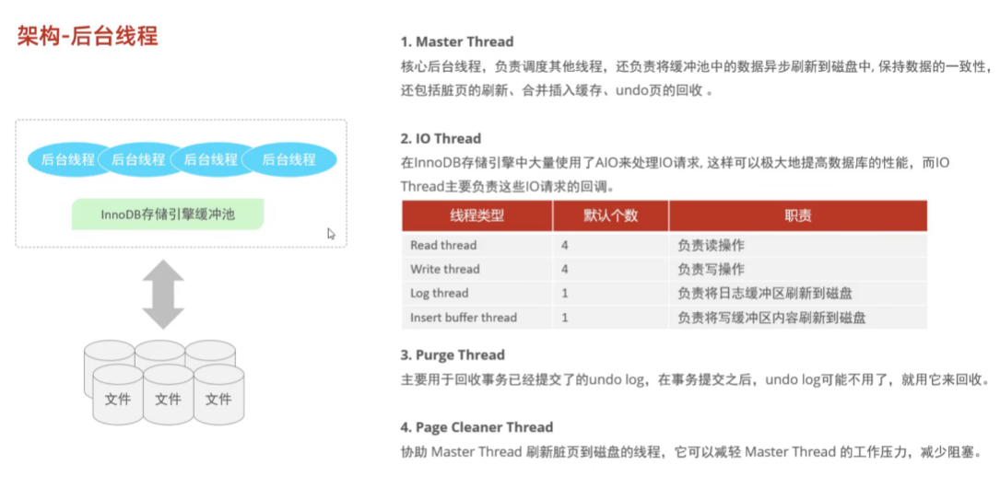

### InnoDB后台线程详解

InnoDB存储引擎通过多线程模型实现高效的内存管理与磁盘数据同步，其后台线程主要包括**Master Thread**、**IO Thread**、**Purge Thread**和**Page Cleaner Thread**四大类，各司其职协作保障事务一致性与高并发性能。



---

#### 一、Master Thread（主线程）
**核心职责**：  
作为调度中心，负责协调其他线程并处理核心任务，优先级最高。  
**主要功能**：
1. **脏页刷新**
    - 定期将缓冲池（Buffer Pool）中修改过的脏页刷盘，通过参数`innodb_max_dirty_pages_pct`控制脏页比例阈值（默认75%）。
    - 结合`innodb_io_capacity`动态调整刷盘速率（如默认每秒刷新200页）。
2. **日志管理**
    - 每秒刷新重做日志缓冲区（Redo Log Buffer）到磁盘，保障事务持久性。
3. **合并插入缓冲（Change Buffer）**
    - 优化非唯一索引的写入操作，合并多个插入操作减少磁盘I/O。
4. **Undo页回收**
    - 定期清理已提交事务的Undo日志页，释放存储空间。

**工作周期**：
- **每秒任务**：刷新日志、合并插入缓冲、检查脏页比例。
- **每10秒任务**：全量脏页刷新、删除无效Undo页。

---

#### 二、IO Thread（I/O线程）
**作用**：通过异步I/O（AIO）处理磁盘读写请求，提升并发能力。  
**分类与配置**：
1. **读线程（Read Thread）**
    - 默认4个（`innodb_read_io_threads`），负责将数据页从磁盘加载到缓冲池。
2. **写线程（Write Thread）**
    - 默认4个（`innodb_write_io_threads`），刷新脏页到磁盘。
3. **日志线程（Log Thread）**
    - 1个，专门处理重做日志的刷盘操作。
4. **插入缓冲线程（Insert Buffer Thread）**
    - 1个，负责合并Change Buffer中的操作到实际索引页。

**查看状态**：
```sql
SHOW ENGINE INNODB STATUS;  -- 查看IO线程运行状态
```

---

#### 三、Purge Thread（清理线程）
**功能**：回收已提交事务的Undo日志页，释放空间供其他事务使用。  
**演进**：
- 早期版本仅1个线程，易成性能瓶颈。
- MySQL 5.7+支持多线程（默认4个，`innodb_purge_threads`参数可调），提升回收效率。  
  **触发条件**：
- 事务提交后，Undo日志不再需要时自动触发。

---

#### 四、Page Cleaner Thread（页清理线程）
**作用**：协助Master Thread刷新脏页，减轻其负载并减少用户线程阻塞。  
**特点**：
- 独立扫描缓冲池中的脏页，批量刷盘以提高效率。
- 通过`innodb_page_cleaners`参数配置线程数（默认与缓冲池实例数一致）。  
  **优势**：
- 分离脏页刷新逻辑，避免Master Thread因刷盘任务过载。

---

#### 五、线程协作与监控
1. **协作关系**
    - Master Thread统筹调度，IO Thread处理具体I/O，Purge/Page Cleaner分担专项任务。
2. **参数调优建议**：
    - 高并发写入场景：增加`innodb_io_capacity`提升刷盘能力。
    - 频繁Undo操作：调大`innodb_purge_threads`加速回收。
3. **监控工具**：
   ```sql
   SHOW VARIABLES LIKE '%innodb%threads%';  -- 查看线程配置
   SHOW ENGINE INNODB STATUS;                -- 查看实时线程状态
   ```

---

#### 总结对比
| **线程类型**       | **核心职责**                         | **关键参数**                          |  
|--------------------|--------------------------------------|---------------------------------------|  
| **Master Thread**  | 全局调度与核心任务（脏页、日志、缓冲） | `innodb_io_capacity`, `innodb_max_dirty_pages_pct` |  
| **IO Thread**      | 异步处理磁盘I/O（读、写、日志）       | `innodb_read/write_io_threads`        |  
| **Purge Thread**   | 回收Undo页                           | `innodb_purge_threads`                |  
| **Page Cleaner**   | 辅助刷新脏页                         | `innodb_page_cleaners`                |  

通过多线程分工协作，InnoDB在保障ACID特性的同时实现了高性能并发处理，合理配置线程参数可针对性优化不同负载场景。