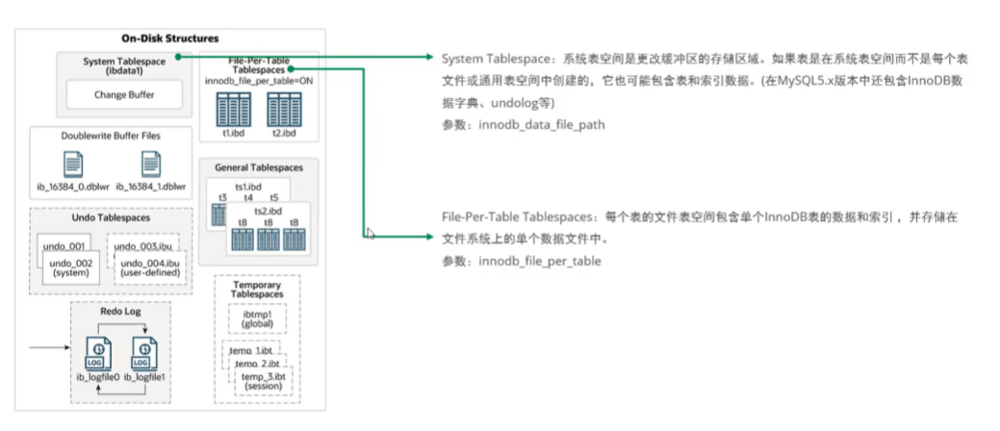
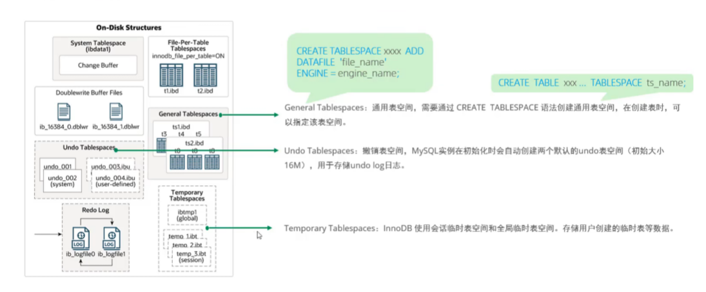
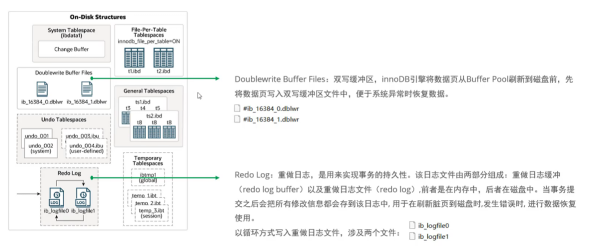

### InnoDB磁盘结构详解

InnoDB的磁盘结构是其实现事务安全、高并发访问和崩溃恢复的核心基础，主要由表空间、日志系统、数据字典等组件构成。以下从核心模块、物理文件结构及工作机制展开说明：

---

#### 一、核心模块
1. **表空间（Tablespaces）**  
   InnoDB的所有数据均存储在表空间中，分为以下类型：

      

      
      
      
      
    - **系统表空间（System Tablespace）**  
      默认文件名为`ibdata1`，包含数据字典（Data Dictionary）、双写缓冲区（Doublewrite Buffer）、Change Buffer和Undo Log的存储区域。在MySQL 8.0前，元数据（如表结构）也存储于此，后续版本独立为数据字典表空间。
    - **独立表空间（File-Per-Table Tablespaces）**  
      每个表对应一个`.ibd`文件，存储表数据、索引及碎片页数组。默认开启（`innodb_file_per_table=ON`），支持空间回收和单表迁移。
    - **通用表空间（General Tablespaces）**  
      用户自定义的共享表空间，可跨数据库存储多个表，通过`CREATE TABLESPACE`创建，适合管理大量小表。
    - **Undo表空间（Undo Tablespaces）**  
      存储Undo Log，支持事务回滚和多版本并发控制（MVCC）。默认文件名为`undo_001`和`undo_002`，8.0后独立于系统表空间。
    - **临时表空间（Temporary Tablespaces）**  
      存储用户临时表和内部临时表数据，默认文件`ibtmp1`，重启时重建。

2. **双写缓冲区（Doublewrite Buffer）**  
   位于系统表空间（8.0.20前）或独立文件（8.0.20后），用于防止页写入不完整（Partial Page Write）。数据页写入前先写入双写缓冲区，再刷入实际位置，崩溃恢复时可从此恢复。

3. **重做日志（Redo Log）**  
   由`ib_logfile0`和`ib_logfile1`组成，循环写入事务操作的物理日志，确保事务持久性（ACID中的D）。日志按16KB页组织，支持崩溃恢复时重放未提交事务。

4. **数据字典（Data Dictionary）**  
   存储元数据（如表名、列定义、索引信息），8.0前嵌入系统表空间，后续版本独立为`mysql.ibd`，减少元数据与用户数据耦合。

---

#### 二、物理文件结构
1. **页（Page）**  
   InnoDB磁盘管理的最小单位（默认16KB），包含以下结构：
    - **文件头（File Header）**：38字节，记录页类型（如`FIL_PAGE_INDEX`）、前后页指针（双向链表）、LSN（日志序列号）等。
    - **页头（Page Header）**：56字节，记录页内记录数、空闲空间位置、最后插入位置等状态。
    - **用户记录（User Records）**：实际存储的行数据，按主键顺序以单向链表组织，含隐藏字段（事务ID、回滚指针）。
    - **页目录（Page Directory）**：稀疏目录结构，存储记录的相对位置（类似跳表），支持快速二分查找。
    - **文件尾（File Trailer）**：8字节校验和，确保页写入完整性。

2. **区（Extent）**  
   由64个连续页组成（默认1MB），用于空间预分配以减少碎片。B+树索引的非叶子节点按区扩展，叶子节点通过双向链表连接。

3. **段（Segment）**  
   逻辑概念，管理物理文件的区分配，包括数据段（B+树叶子节点）、索引段（非叶子节点）、回滚段等。每个段包含256个区（256MB）。

---

#### 三、工作机制与优化
1. **B+树索引与数据存储**
    - **聚集索引**：叶子节点直接存储数据行，物理顺序与主键一致，通过双向链表支持范围查询。
    - **二级索引**：叶子节点存储主键值，需回表查询完整数据。索引页通过稀疏目录（Page Directory）加速查找。

2. **页分裂与合并**
    - **页分裂**：插入数据导致页溢出时，原页拆分为两页，父节点新增指针，可能引发B+树层级扩展。
    - **页合并**：删除数据后相邻页空闲空间超过阈值（默认50%）时合并，减少碎片。

3. **日志与恢复机制**
    - **Redo Log**：事务提交时按策略（`innodb_flush_log_at_trx_commit`）刷盘，确保崩溃后重放日志恢复数据。
    - **Undo Log**：存储事务前的数据镜像，支持回滚和MVCC，独立表空间减少系统表空间压力。

---

#### 四、关键文件类型
1. **系统文件**
    - `ibdata1`：系统表空间文件。
    - `undo_001`/`undo_002`：Undo表空间文件。
    - `ibtmp1`：临时表空间文件。

2. **用户表文件**
    - `.ibd`：独立表空间文件，含表数据和索引。
    - `.frm`：8.0前存储表结构，后续版本元数据并入数据字典。

3. **日志文件**
    - `ib_logfile0`/`ib_logfile1`：Redo Log文件。
    - `binlog`：二进制日志（MySQL层），记录逻辑操作。

---

#### 五、总结
InnoDB的磁盘结构通过表空间分层管理、B+树索引组织和日志系统协作，实现了高效的事务处理与数据安全。合理配置表空间类型、监控页分裂/合并、优化日志刷盘策略是提升性能的关键。理解物理文件结构（如页、区、段）有助于诊断存储瓶颈和设计高效索引。